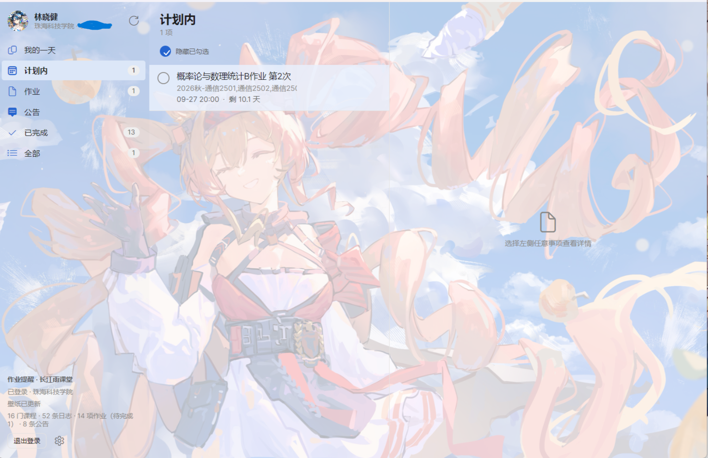
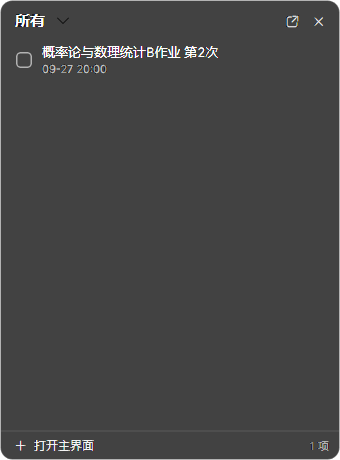

# 作业提醒 · HomeworkReminder

用 Avalonia 写的 Windows 桌面待办应用：自动读取**长江雨课堂**的作业与公告，
以仿 Microsoft To Do 的 Fluent 界面呈现。



## 功能与特性

* **作业清单**：按课程归集作业，显示截止时间与剩余天数，逾期自动标红

* **真实完成状态**：完成进度直接来自雨课堂的作答记录，而不是「截止时间过了没有」

* **公告未读**：公告按已读/未读分组，支持单条已读与全部已读

* **两种登录方式**：应用内嵌官方登录页微信扫码；没有 WebView2 的机器可改用粘贴 Cookie 登录

* **Fluent 半透明界面**：亚克力磨砂背景，支持自定义壁纸与透明度滑块

* **深色模式**：浅色 / 深色 / 跟随系统，即时切换

* **托盘常驻**：关闭时可选择「最小化运行」，收到新作业随时点开

* **隐私安全**：登录态文件用 Windows DPAPI 加密存放，只有本机当前用户能解开

* **学期可配置**：编辑数据目录下的 `settings.json` 即可切换学期与学校，不用改代码

* **定时自动同步**：默认每 30 分钟同步一次作业列表，间隔可在 `settings.json` 调整（`0` = 关闭）

* **新作业通知**：发现新作业时发 Windows 系统通知，点击直达该课程的雨课堂页面

* **桌面小组件**：仿滴答清单的桌面挂件，半透明玻璃面板、可拖动、可缩放，位置与尺寸自动记忆，浅色/深色跟随主程序

## 快速开始

双击运行 `HomeworkReminder.Desktop.exe`，首次启动会显示登录页：

1. **扫码登录**（默认）——应用内嵌雨课堂官方登录页，微信扫码即可；
2. **粘贴 Cookie**——缺少 WebView2 运行时时点「改用 Cookie 登录」，从浏览器
   F12 → Network 复制任意 `v2/api/web` 请求的 `cookie` 请求头粘贴进去。

登录成功后自动同步，之后每次启动都会刷新作业列表。

## 自动同步与通知

默认每 **30 分钟**自动同步一次。**首次同步只建立基线**，不会把已有作业全报一遍；
之后每次同步只对**新增**作业发通知。判定用稳定 Id 而非标题，改标题不会误报。

相关设置（`settings.json`，与 `session.json` 同目录，改完重启生效）：

| 字段                      | 默认    | 说明                                              |
| ----------------------- | ----- | ----------------------------------------------- |
| `AutoRefreshMinutes`    | `30`  | 自动同步间隔（分钟）。`0` = 关闭；低于 5 会被夹到 5，避免频繁请求被风控      |
| `NotifyOnNewHomework`   | `true` | 是否发系统通知                                        |
| `WidgetVisible`         | `false` | 是否显示桌面小组件                                      |
| `WidgetX` / `WidgetY`   | —     | 小组件位置，拖动后自动写入                                  |
| `WidgetGroup`           | `myday` | 小组件当前分组（myday / homework / planned / all）      |

### 通知链路自检

通知涉及注册表、开始菜单快捷方式与 WinRT 三层，出问题时不易定位，因此单独留了自检：

```powershell
.\HomeworkReminder.Desktop.exe --toastcheck
```

逐项报告：AUMID 注册 → 开始菜单快捷方式 → toast XML 生成与转义 → WinRT 投递（失败给 HRESULT）。

> **实现说明**：未打包（unpackaged）的 Win32 应用发 toast 需要三个条件，缺一不可：
> ① 注册 `HKCU\Software\Classes\AppUserModelId\<aumid>`；
> ② 在开始菜单放一个带 `System.AppUserModel.ID` 属性的快捷方式
> ——实测**只做 ① 不够**，`CreateToastNotifier` 会返回 `0x80070490`（找不到元素）；
> ③ 走 WinRT `ToastNotificationManager`。
> 三处写入都在 HKCU 与用户自己的开始菜单目录，**不需要管理员权限**。
> 本仓库的离线包源没有任何通知相关 NuGet 包，这一层是手写的 COM 互操作
> （`Services/WinRtToast.cs`），与 `Dpapi` 同一取舍。

## 桌面小组件

从**托盘菜单 → 显示桌面小组件**开启，再点一次关闭。

* 无边框、透明、普通窗口层级（不置顶；从托盘/主界面召唤时会到最前），左键拖动移动位置、拖边缘/角落调整大小（停下即记忆）
* 直接复用主界面已同步的数据，**不额外请求网络**，与主界面始终一致
* 双击条目在浏览器打开；点勾选框在应用内标记
* 只显示「雨课堂未完成 **且** 应用内未勾掉」的事项，与主界面口径一致



## 数据存放

| 位置                                               | 内容                                                                                                         |
| ------------------------------------------------ | ---------------------------------------------------------------------------------------------------------- |
| `%LOCALAPPDATA%\HomeworkReminder\`               | `session.json`（DPAPI 加密的登录态）、`local-state.json`（本地勾选/已读）、`settings.json`（壁纸/透明度/主题等设置）、`startup.log`（启动日志） |
| exe 旁边的 `HomeworkReminder.Desktop.exe.WebView2\` | 登录页浏览器内核的缓存（WebView2 默认行为）                                                                                 |

数据目录可用环境变量 `HOMEWORKREMINDER_DATA_DIR` 覆盖。

## 打包发布

```powershell
.\tools\publish.ps1 -Mode trim   -NoPdb   # 裁剪单文件：40.8 MB，双击即用（推荐分发）
.\tools\publish.ps1 -Mode single -NoPdb   # 完整单文件：约 100 MB，兼容性最好
.\tools\publish.ps1 -Mode fdd             # 框架依赖：体积最小，目标机需装 .NET 10 运行时
.\tools\publish.ps1 -Mode sc              # 自包含多文件
```

产物在 `publish\<模式>\` 下。**分发前请删除产物目录里的 `.WebView2` 文件夹**
（里面是本机登录页的 cookie 缓存），只发 exe 文件本身。

### 发布产物自检

```powershell
.\HomeworkReminder.Desktop.exe --selfcheck out.png   # 窗口/绑定自检 + 离屏渲染
.\HomeworkReminder.Desktop.exe --jsoncheck           # 序列化路径自检（裁剪版必过项）
.\HomeworkReminder.Desktop.exe --toastcheck          # 通知链路自检
.\HomeworkReminder.Desktop.exe --selfcheck-widget w.png  # 小组件渲染自检
```

两者退出码为 0 即表示产物健康。

## 项目结构

```
HomeworkReminder/                 共享项目：模型、服务、视图、ViewModel
  Models/                         TodoItem 等数据模型
  Services/
    YktApiClient.cs               雨课堂接口客户端（唯一的网络出入口）
    SyncService.cs                课程/日志/进度三源合并 → 待办
    SessionStore.cs               登录态持久化（DPAPI 加密）
    AppJsonContext.cs             源生成 JSON 序列化上下文
    YktLoginService.cs            WebView 扫码登录
    AutoSyncService.cs            定时同步 + 新作业判定（可脱离 UI 测试）
    Notifier.cs / WinRtToast.cs   系统通知抽象与 WinRT COM 互操作
  Views/                          MainWindow / TodoShellView / LoginView
                                  WidgetView + WidgetWindow（桌面小组件）
  Styles/TodoTheme.axaml          仿 To Do 的 Fluent 控件样式（含深色主题）
  Styles/WidgetTheme.axaml        桌面小组件的深色半透明样式
HomeworkReminder.Desktop/         桌面宿主（启动、托盘、自检入口）
tools/                            构建、发布、冒烟测试脚本
docs/                             接口实测文档与调研记录
```

## 开发

```powershell
.\tools\run.ps1                              # 构建并启动（数据目录指向 .appdata）
dotnet run --project tools\SyncSmoke         # 无界面跑一遍真实同步，打印待办结果
```

> 本仓库默认离线还原配置（`NuGet.Config` 指向仓库内 `packages/`）。在可联网的
> 机器上可删除 `NuGet.Config`、`packages/`、`.nuget-packages/`，直接 `dotnet restore`。

## 已知限制

* 雨课堂没有「学生标记作业完成」的接口，应用内的勾选只影响本地视图

* 全部接口来自雨课堂网页端自身，非公开契约，前端改版可能导致失效；
  代码对每个调用做了容错（单课程失败不中断整次同步，并汇总为界面警告条）

* Android / iOS / Browser 端沿用模板但未经验证

